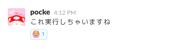
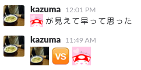

# Slack の楽しみ方

[port-mokumoku #19](http://freestyle-mokumoku.connpass.com/event/36140/)

---

# だれこれ

---

## Masataka Kuwabara (a.k.a. pocke)

- Actcat Inc.
- PORT Inc.

---

# ところで

---

## Slack楽しんでますか?

---

---

## 今日はSlackの楽しみ方を話します

---

# 1. Emoji

---

## Slackでは、Emojiが使えます

---

例

---

## こんなとこがいい

- 雰囲気が柔らかくなる
- なんか楽しい!
- 楽しい!!

---

# 2. Reaction

---

## Slackでは、EmojiでReactionができます

---

例

---

## こんなとこがいい

- メンション飛ばす程じゃないけど…な反応
- なんか賑やか
- 楽しい!!!

---

# 3. Custom Emoji

---

## Slackでは、独自Emojiを登録できます

---

`https://<Your Domain>.slack.com/customize/emoji` から登録できます

---

## おすすめ

---

### oti/slack-reaction-decomoji

https://github.com/oti/slack-reaction-decomoji

便利なEmojiを沢山追加できる

---

例

---

### Emoji of Members

メンバーの絵文字を追加する

---

---

なぜか私はふたつある

---

Reactionと合わせて投票に便利

---

## こんなとこがいい

- 意外と便利
- なんて呼ぶのが適切か問題の解決
- 楽しい!!!!!!!

---

# 4. Hubot

---

Demo

---

<blockquote class="twitter-tweet" data-lang="en">
弊社Slackがひどい <a href="https://t.co/nGz1wstjHx">pic.twitter.com/nGz1wstjHx</a>
&mdash; Pocke (@p_ck_) <a href="https://twitter.com/p_ck_/status/750597844072095744">July 6, 2016</a></blockquote>

---

# まとめ

---

- Slack x Emoji は楽しい!
- カスタマイズによって無限の可能性!
- もっともっと楽しい使い方があったら教えて下さい :bow:
